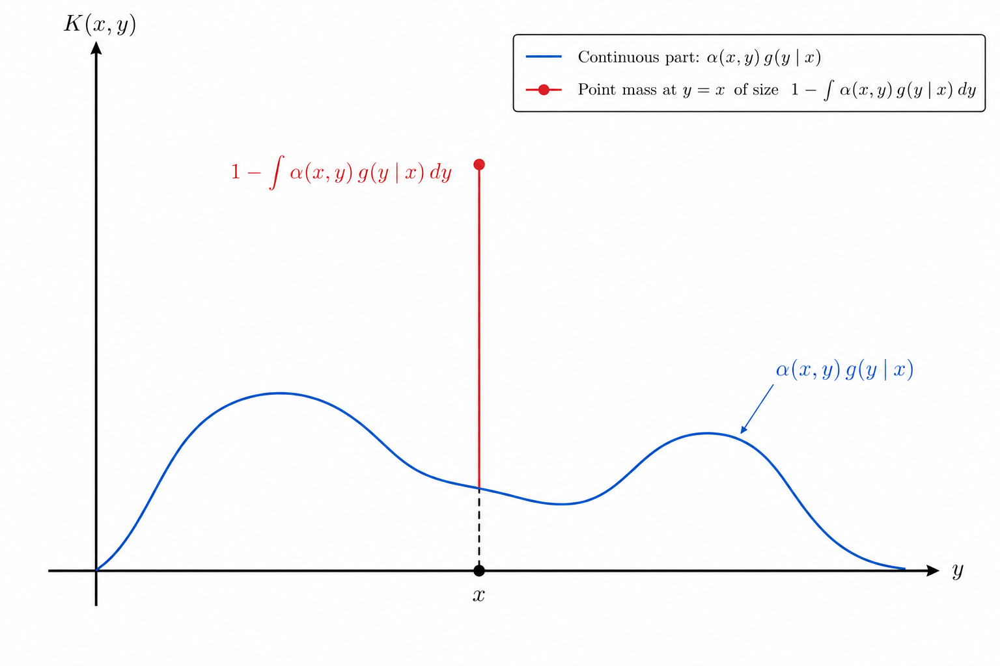
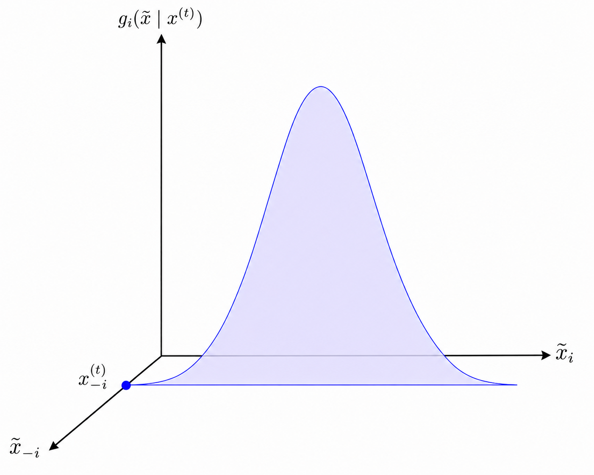

<!-- Requires 'collapse-output' quarto package: https://github.com/mcanouil/quarto-collapse-output -->

```{r}
#| output-fold: true
#| jupyter: {outputs_hidden: true}
sessionInfo()
```

```{r}
#| output-fold: true
#| jupyter: {outputs_hidden: true}
library(ggplot2)
```

## Introduction

Markov chain Monte Carlo (MCMC) is a collection of methods simulating a distribution $\pi$ by generating a Markov chain whose limiting distribution equals $\pi$.

## Review: Markov chain

### Definition

A distcrete time, discrete-state-space Markov chain is a sequence of random variables $\{X_n\}$ where $X_n \subset S \subset \mathbb{N}$ for all $n=0, 1, 2,\dotsc$,
with 
$$
    \Pr(X_{n+1} \mid X_n = i, X_{n-1} = i_{n-1}, \dotsc ) = \Pr(X_{n+1}=i \mid X_n = i) =: P_{ij}(n)
    .
$$ 
Here, $S$ is called the *state space*, and $P_{ij}$ is called the (state-) transition probabilty.

-   Obviously, $\sum_{j\in S} P_{ij}(n) = 1$, for all $i\in S$.
-   $P(n) := (P_{ij}(n))_{i,j \in S}$, transition probability matrix.
-   $P(n) = P$ for all $n$, time-homogenity.

#### Example 1. Simple random walk

$$
\begin{align*}
\Delta_i &= \begin{cases} -1, & \text{w.p.} p \\ -1, & \text{w.p.} 1- p \end{cases}
,
\quad
\{\Delta_i\}~\text{i.i.d.}
\\
X_{n+1} &= X_n + \Delta_{n+1} 
,
\quad
X_0 = 0
.
\end{align*}
$$

-   $P_{i,i+1} = p$, $P_{i,i-1} = 1 - p$, $S = \mathbb{N}$.

#### Example 2. Gambler's ruin

-   $N$: casino's wealth. $S = \{1, 2 \dotsc, N\}$ (gambler's wealth)
-   $P_{00} = 1$ (gambler's ruin); $P_{NN} = 1$ (casino's ruin)
-   $P_{i,i+1} = p$, $P_{i,i-1} = 1-p$.

### Chapman-Kolmogorov equation

-   For a time-homogeneous Markov chain, let $P^{(n)} = (P_{ij}^{(n)})$, $P_{ij}^{(n)} = \Pr(X_{m+n}=j \mid X_m = i)$.
-   Then, $P^{(m+n)} = P^{(m)} P^{(n)}$.
-   So $P^{(n)} = P^n$.

### Communication classes

-   $i \rightarrow j$ (reachable) if $P_{ij}^{(n)} > 0$ for some $n \geq 0$.
-   $j \rightarrow i$ if $P_{ji}^{(n)}$ for some $n \geq 0$.
-   $j \leftrightarrow i$ (communicates) if and only if $i \rightarrow j$ and $j \rightarrow i$.

-   $S$ is partitioned by communication classes

-   A Markov chain is called **irreducible** if it has only one communication class, i.e., all states communicates.

#### Example

-   Random walk: $S = \mathbb{N}$, irreducible.
-   Gambler's ruin: $S = \{0\} \cup \{1, \dotsc, N-1\} \cup \{N\}$.


### Limiting distributions of a Markov chain

::: {.callout-note}

Q: Will there be $\pi_j$'s such that $\lim_{n\to\infty} P_{ij}^{(n)} = \pi_j$, $\forall i \in S$, $\sum_{j\in S}\pi_j = 1$?

:::

If the chain converges to an equillibrium, then $\lim_{n\to\infty} P_{ij}^{(n)}$ should exist and be independent of of the starting state.

-   Stationary distribution: $\pi = (\pi_j)_{j\in S}$ such that
$$
    \pi = \pi P, \quad \mathbf{1}^\top \pi = 1, \quad \pi \geq 0.
$$
    +   If $\pi^{(0)} = \pi$, then $\pi^{(1)} = \pi^{(0)}P = \pi$, $\pi^{(2)} = \pi^{(1)}P = \pi$, ...
    +   Also called the invariant distribution.
    +   If $P_{ij}^{(n)} = (P^n)_{ij} \to \pi_j$, then 
$$
\begin{align*}
    \pi &= \lim_{n\to\infty} (P^{n+1})_{i\cdot} = \lim_{n\to\infty} (P^n P)_{i\cdot} 
    \\
    &= 
    \sum_{j\in S}(\lim_{n\to\infty}(P^n)_{ij}) P_{j\cdot} = \sum_{j\in S} \pi_j P_{j\cdot} = \pi P.
\end{align*}
$$
        Thus the limiting distribution is a stationary distribution.
    +   Will the stationary disbution uniquely exist?


-   Long-run proportion of time that a Markov chain stays at state $j$
$$
    \lim_{n\to\infty} \frac{1}{n}\sum_{k=1}^n I\{X_k = j\}
$$
    +   Does this limit exists? If so, will it coincides with $\pi$?

#### Characteristics of Markov chains

-   A *period* of a Markov chain is
$$
    d(j) \triangleq GCD\{n: P_{jj}^{n} > 0\}
    .
$$
    +   A Markov chain is **aperiodic** if $d(i) = 1$ for all $i \in S$;

-   Recurrence
    +   First return time to state $i$
$$
        \tau_{ii} = \begin{cases} \min\{n \geq 1: X_n = i, X_0 = i\}, & ~ \\ \infty, \text{if}~X_n \neq i, \forall n > 0. \end{cases}
$$
    +   State $i$ is
        +   *recurrent* if $\tau_{ii} < \infty$ with probability 1. (e.g., symmetric random walk) --- the chain returns to state $i$ infinitely often.
            +   **positive recurrent** if $\operatorname{E}[\tau_{ii}] < \infty$;
            +   null recurrent if $\operatorname{E}[\tau_{ii}] = \infty$.
        +   *transient* otherwise. (e.g., asymmetric random walk)
    +   If $i \leftrightarrow j$, then $i$ and $j$ are either recurrent or transient at the same time --- recurrence is the communication class property.
    +   For a communication class $C$, all states in $C$ are either transient, positive recurrent, or  null recurrent.

-   Ergodicity: a Markov chain is **ergodic** if it is aperiodic and positive recurrent.
    +   In a *finite state-space*, irreducible Markov chain, all states are positive recurrent --- aperiodic + irreducible = ergodic.

#### Limit Theorems

1.  If a Markov chain is irreducible and ergodic, then
    a.  the limit $\lim_{n\to\infty} P_{ij}^{(n)} = \pi_j$ exists, *independent of* $i$;
    b.  $\pi = (\pi_j)_{j\in S}$ **uniquely** satisfies $\pi = \pi P$, $\mathbf{1}^\top \pi = 1$, $\pi \geq 0$;
    c.  $\pi_j = \lim_{n\to\infty}\frac{1}{n}\sum_{k=1}^n I\{X_k=j \mid X_0=i\} = 1/\operatorname{E}[\tau_{jj}]$.

2.  For an irreducible, aperiodic Markov chain, if there is a solution to the equation $\pi = \pi P$, $\mathbf{1}^\top \pi = 1$, $\pi \geq 0$;
then $\lim_{n\to\infty} P_{ij}^{(n)} = \pi_j$, and the chain is positive recurrent.


#### Ergodic Theorem 

-   Let $\{X_n\}$ be a irreducible, ergodic Markov chain whose stationary distribution is $\pi$. Then,
for any function $g$ such that $\operatorname{E}_{\pi}[|g(X)|] < \infty$ where $X \sim \pi$, we have
$$
    \frac{1}{n}\sum_{k=1}^n g(X_k) \stackrel{n\to\infty}{\to} \operatorname{E}_{\pi}[g(X)]
$$
with probabilty 1.

-   The ergodic theorem extends the strong law of large numbers from i.i.d. sequences to Markov chains.
-   Thus we can extend Monte Clarlo integration to Markov (non-i.i.d.) seqeunces --- Markov chain Monte Carlo (MCMC)

#### MCMC sampling strategy

-   Construct an irreducible, aperiodic, and positive recurrent Markov chain for which the stationary distribution equals the target distribution $f$.

-   From these samples, expectations of functions of random variable $X \sim f$ can be reliably estimated.

#### Detailed balance condition

-   If a homogeneous MC satisfies the stronger condition
$$
    \pi_i P_{ij} = \pi_j P_{ji}
    ,
$$
then $\pi = (\pi_i)_{i\in S}$ is a stationary distribution of the MC. (Why?)

-   In fact such a Markov chain is reversible because the joint distribution of the chain is the same whether the chain is run forward or backward.

### Extension to continuous state space

-   Continuous-state-space, time-homogeneous MC
$$
    P_{ij} \rightarrow K(x, y)
$$
where $K(x, y) = P_{X_{n+1}\mid X_n}(y \mid x$ is the *transition density* such that $\int_S K(x, y) dy = 1$.

-   Irreducibility, recurrence, stationary distribution, etc. are defined analogously as the discrete state space case.

-   Detailed balance condition:
$$
    \pi(x) K(x, y) = \pi(y) K(y, x)
    \implies
    \pi(y) = \int_S \pi(x) K(x, y) dx
$$

-   Limiting theorems also hold analogously.

## Metropolis-Hastings algorithm

-   Metropolis N, Rosenbluth AW, Rosenbluth MN, Teller AH, Teller E (1953). "Equation of State Calculations by Fast Computing Machines". J. Chem. Phys. 21 (6): 1087.

-   Hastings WK (1970). "Monte Carlo Sampling Methods Using Markov Chains and Their Applications". Biometrika. 57 (1): 97–109.

### The algorithm

For $t= 0, 1, \dotsc$, 

1.  Sample a condidate alue $\tilde{X}$ from a *proposal distribution* $g(\cdot \mid X^{(t)})$.

2.  Compute the Metropolis-Hastings ratio
$$
    R(X^{(t)}, \tilde{X}) = \frac{f(\tilde{X})g(X^{(t)}\mid \tilde{X})}{f(X^{(t)})g(\tilde{X}\mid X{^(t)})}
    .
$$

3.  Sample a value for $X^{(t+1)}$ such that
$$
    X^{(t+1)} = \begin{cases} \tilde{X}, & \text{w.p.}~\min\{R(X^{(t)}, \tilde{X}), 1\},
        \\
        X^{(t)}, & \text{otherwise}. 
    \end{cases}
$$
    +   $\alpha(X^{(t)}, \tilde{X}) = \min\{R(X^{(t)}, \tilde{X}), 1\}$ is the acceptance probability of the proposal.

**Note**. The MH ratio $R(X^{(t)}, \tilde{X})$ is well-defined for each $t$ if we draw $X^{(0)}$ from some starting distribution, with requirement $f(X^{(0)}) > 0$.

-   Metripolis (1953): $g(u \mid v) = g(v \mid v)$ (symmetric)

### Stationary distribution

-   Transition probability kernel
$$
    K(x, y) = \alpha(x, y)g(y\mid x) + (1 - r(x))\delta(y - x)
$$
where
$$
    \alpha(x, y) = \min\left\{1, \frac{f(y)g(x\mid y)}{f(x)g(y\mid x)}\right\}
    ,
    \quad
    r(x) = \int \alpha(x, y) g(x \mid y) dv
$$
and the $\delta$ is the Dirac delta function.



-   Note
    a.  $f(x)\alpha(x, y)g(y\mid x) = \min\{f(x)g(y \mid x), f(y)g(x \mid y)\} = f(y)\alpha(y, x)g(x \mid y)$;
    b.  $f(x)(1 - r(x))\delta(y - x) = f(y)(1 - r(y))\delta(x - y)$ by the property of Dirac delta.

-   It follows $f(x)K(x, y) = f(y)K(y, x)$, the detailed balance equation.

-   Therefore $f$ is the stationary distribution of this MC.

-   Irreducibility, aperiodicity, positive recurrence of this MC depends on $g(\cdot\mid\cdot)$ and the user must check.

-   Aperiodicity usually holds since $\Pr(X^{(t+1)} = X^{(t)}) > 0$ (rejection probability).

-   Irreducibility holds if $f(x) > 0$ for all $x \in S$ and the chain defined by the kernal $\tilde{K}(x, y) = g(y|x)$ is irreducible.

#### Example: discrete Metropolis

-   For each state $i$, assume that $g(i, i) > 0$ and there exists a neighboring state $j$ ($g(j\mid i) > 0$) such that $f(i) > f(j)$. Then
$$
    \alpha(i, j) = \min\{ f(j)/f(i), 1\} < 1
    .
$$
Thus
$$
    r(i) = \sum_{j'}\alpha(i, j')g(j'\mid i) < \sum_{j'} g(j'\mid i) = 1
$$
and $K(i, i) = \alpha(i, i)g(i, i) + 1 - r(i) > 0$.

-   Therefore $d(i) = 1$.


```{r}
MH_sampler <- function(target_log_density, proposal,
                       N = 10000, burn_in = 1000, 
                       thin = 1 ) {
  theta <- numeric(N)
  theta[1] <- 0 # initialize
  acc <- 0L # accepted?

  for (t in 2:N) {
    current <- theta[t - 1]
    theta_tilde <- proposal$sample(1)

    # log acceptance ratio:
    log_alpha <- target_log_density(theta_tilde) +
      proposal$log_density(current, theta_tilde) -
      target_log_density(current) -
      proposal$log_density(theta_tilde, current)

    if (log(runif(1)) < min(0, log_alpha)) {
      theta[t] <- theta_tilde
      acc <- acc + 1L
    } else {
      theta[t] <- current
    }
  }

  # Thin and discard burn-in (more on this later)
  list(
    theta = theta[seq(from = burn_in + 1, to = N, by = thin)],
    theta_all = theta,
    acceptance_rate = acc / (N - 1),
    target_log_density = target_log_density
  )
}
```

#### Example: posterior sampling

-   Goal: We want to sample from the posterior density $p_{\Theta\mid Y}(\theta \mid y)$, with $p_{\Theta}(\theta)$ a prior. 

-   Difficulty: $p_{\Theta\mid Y}(\theta \mid y) = c p_{Y\mid\Theta}(y\mid \theta)p_{\Theta}(\theta)$, $c > 0$ unknown.

-   Solution: Metropolis-Hastings MCMC
    +   Target distribution: $f(\cdot) = p_{\Theta\mid Y}(\cdot \mid y)$
    +   M-H ratio
$$
\begin{align*}
    R(\theta^{(t)}, \tilde{\theta})
    &=
    \frac{f(\tilde{\theta})g(\theta^{(t)} \mid \tilde{\theta})}{f(\theta^{(t)})g(\tilde{\theta} \mid \theta^{(t)})}
    =
    \frac{p_{\Theta\mid Y}(\tilde{\theta}\mid y)g(\theta^{(t)}\mid \tilde{\theta})}{p_{\Theta\mid Y}(\theta^{(t)}\mid y)g(\tilde{\theta}\mid \theta^{(t)})}
    \\
    &=
    \frac{c p_{Y\mid\Theta}(y\mid \tilde{\theta})p_{\Theta}(\tilde{\theta})g(\theta^{(t)}\mid\tilde{\theta})}{c p_{Y\mid\Theta}(y\mid \theta^{(t)})p_{\Theta}(\theta^{(t)})g(\tilde{\theta}\mid\theta^{(t)})}
    =
    \frac{p_{Y\mid\Theta}(y\mid \tilde{\theta})p_{\Theta}(\tilde{\theta})g(\theta^{(t)}\mid\tilde{\theta})}{p_{Y\mid\Theta}(y\mid \theta^{(t)})p_{\Theta}(\theta^{(t)})g(\tilde{\theta}\mid\theta^{(t)})}
\end{align*}
$$
which is independent of $c$!

-   Independent chain: $g(\cdot, *) = p_{\Theta}(\cdot)$
    +   M-H ratio
$$
\begin{align*}
    R(\theta^{(t)}, \tilde{\theta})
    &=
    \frac{p_{Y\mid\Theta}(y\mid \tilde{\theta})p_{\Theta}(\tilde{\theta})g(\theta^{(t)}\mid\tilde{\theta})}{p_{Y\mid\Theta}(y\mid \theta^{(t)})p_{\Theta}(\theta^{(t)})g(\tilde{\theta}\mid\theta^{(t)})}
    =
    \frac{p_{Y\mid\Theta}(y\mid \tilde{\theta})p_{\Theta}(\tilde{\theta})p_{\Theta}(\theta^{(t)})}{p_{Y\mid\Theta}(y\mid \theta^{(t)})p_{\Theta}(\theta^{(t)})p_{\Theta}(\tilde{\theta})}
    \\
    &=
    \frac{p_{Y\mid\Theta}(y\mid \tilde{\theta})}{p_{Y\mid\Theta}(y\mid \theta^{(t)})}
\end{align*}
$$
only depends on the likelihood.

#### Example: Binomial-logit mixture

Suppose $x$ is a random sample from a Binomial distribution with $n$ trials and success probability $p=\frac{e^{\theta}}{1 + e^{\theta}}$.
Suppose the prior on $\theta$ is $N(0, \sigma^2)$. 

* Prior density: $f_{\Theta}(\theta) = \frac{1}{\sqrt{2\pi\sigma^2}}e^{-\theta^2/(2\sigma^2)}$.
* Likelihood: $f_{X|\Theta}(x|\theta) = \binom{n}{x}p^x(1 - p)^{n-x}$, with
$p=\frac{e^{\theta}}{1 + e^{\theta}}$.
* Posterior density:
$$
\begin{align*}
    f_{\Theta|X}(\theta|x) &= \frac{f_{X|\Theta}(x | \theta)f_{\Theta}(\theta)}{\int_{-\infty}^{\infty}f_{X|\Theta}(x | \theta')f_{\Theta}(\theta')d\theta'}
    = \frac{p(\theta)^x[1-p(\theta)]^{n-x}e^{-\theta^2/(2\sigma^2)}}{\int_{-\infty}^{\infty}p(\theta)^x[1-p(\theta)]^{n-x}e^{-\theta^2/(2\sigma^2)}d\theta}
    \\
    &= \frac{e^{\theta x}[1+e^{\theta}]^{-n}e^{-\theta^2/(2\sigma^2)}}{\int_{-\infty}^{\infty}e^{\theta x}[1+e^{\theta}]^{-n}e^{-\theta^2/(2\sigma^2)}d\theta}
\end{align*}
$$

```{r}
log_binom_logit_posterior <- function(x, n, sigma) {
  function(theta) {
    p <- plogis(theta)  # numerically stable logistic transform
    dbinom(x, size = n, prob = p, log = TRUE) +
        dnorm(theta, mean = 0, sd = sigma, log = TRUE)
  }
}
independent_normal_proposal <- function(prop_mean = 0, 
                                        prop_sd = 1) {
  list(
    sample = function(n) { rnorm(n, mean = prop_mean, 
                                 sd = prop_sd) },
    log_density = function(theta, phi) { # discard 2nd arg
        dnorm(theta, mean = prop_mean, sd = prop_sd, 
              log = TRUE)
    }
   )
}
plot_posterior <- function(posterior_df, target_log_density) {
  # Create a grid of theta values
  theta_grid <- seq(min(posterior_df$theta) - 1,
                    max(posterior_df$theta) + 1,
                    length.out = 1000)
  # Unnormalized posterior
  log_post <- target_log_density(theta_grid)
  post <- exp(log_post - max(log_post)) # to avoid overflow

  posterior_curve <- data.frame(theta = theta_grid, 
                                density = post)

  # Normalize numerically
  dx <- theta_grid[2] - theta_grid[1]
  posterior_curve$density <- posterior_curve$density /
    sum(posterior_curve$density * dx)

  # Plot MCMC histogram against posterior curve
  ggplot() +
  geom_histogram(data = posterior_df,
    aes(x = theta, y = after_stat(density)),
    bins = 40, fill = "skyblue",
    color = "black", alpha = 0.5
  ) +
  geom_line(data = posterior_curve,
    aes(x = theta, density), color = "red",
    linewidth = 1.2
  ) +
  labs(
    title = "Independent MH Samples vs. Posterior Density",
    x = expression(theta),
    y = "Density"
  ) +
  theme_minimal(base_size = 14)
}
```

```{r}
set.seed(2020)
sigma <- 10
my_prop <- independent_normal_proposal(prop_sd = sigma)
my_target1 <- log_binom_logit_posterior(x = 18, n = 20, sigma = sigma)
fit1 <- MH_sampler(target_log_density = my_target1,
  proposal = my_prop, N = 20000, burn_in = 2000,
  thin = 5)
posterior_df1 <- data.frame(theta = fit1$theta)
cat("Acceptance rate = ", fit1$acceptance_rate, ", Sample size = ", length(fit1$theta), "\n")
my_target2 <- log_binom_logit_posterior(x = 180, n = 200, sigma = sigma)
fit2 <- MH_sampler(target_log_density = my_target2,
  proposal = my_prop, N = 20000, burn_in = 2000,
  thin = 5)
posterior_df2 <- data.frame(theta = fit2$theta)
cat("Acceptance rate = ", fit2$acceptance_rate, ", Sample size = ", length(fit2$theta), "\n")
```

```{r}
plot_posterior(posterior_df1, target_log_density = my_target1)
plot_posterior(posterior_df2, target_log_density = my_target2)
```


## Gibbs sampler

-   For a multidimensional target distribution with a Cartesian product state space, *sequentially* sample from univariate conditional distributions, which is often of closed form.

-   Let $X = (X_1, \dotsc, X_p)$ and $X_{-i} = (X_1, \dotsc, X_{i-1}, X_{i+1}, \dotsc, X_p)$.

-   Generate
$$
\begin{align*}
    X_1^{(t+1)} &\sim f_{X_1 \mid X_{-1}}(\cdot \mid X_2^{(t)}, X_3^{(t)}, \dotsc, X_p^{(t)})
    \\
    X_2^{(t+1)} &\sim f_{X_2 \mid X_{-2}}(\cdot \mid X_1^{(t+1)}, X_3^{(t)}, \dotsc, X_p^{(t)})
    \\
    & \vdots
    \\
    X_{p-1}^{(t+1)} &\sim f_{X_{p-1} \mid X_{-(p-1)}}(\cdot \mid X_2^{(t+1)}, \dotsc, X_{p-2}^{(t+1)}, X_p^{(t)})
    \\
    X_p^{(t+1)} &\sim f_{X_p \mid X_{-p}}(\cdot \mid X_1^{(t+1)}, X_2^{(t+1)}, \dotsc, X_{p-1}^{(t)})
\end{align*}
$$
cf. Gauss-Seidel.

#### Example: bivariate normal

-   Target distribution: 
$$
\begin{pmatrix} X_1 \\ X_2 \end{pmatrix} \sim 
N\left( \begin{pmatrix} 0 \\ 0 \end{pmatrix}, \begin{pmatrix} 1 & \rho \\ \rho & 1 \end{pmatrix}\right)
$$

-   $X_1 \mid \{X_2 = x_2\} \sim N(\rho x_2, 1 - \rho^2)$,
    $X_2 \mid \{X_1 = x_1\} \sim N(\rho x_1, 1 - \rho^2)$.

-   Therefore, sample $X_1^{(t+1)} \sim N(\rho X_2^{(t)}, 1 - \rho^2)$ and $X_2^{(t+1)} \sim N(\rho X_1^{(t+1)}, 1 - \rho^2)$.

```{r}
Rgibbs <- function(N, thin, rho=0) {
  mat <- matrix(0, nrow=N, ncol=2)
  x <- y <- 0
  for (i in 1:N) {
    for (j in 1:thin) {
      x <- rnorm(1, rho * y, sqrt(1 - rho * rho))
      y <- rnorm(1, rho * x, sqrt(1 - rho * rho))
    }
    mat[i,] <- c(x, y)
  }
  df <- as.data.frame(mat)
  names(df) <- c("x1", "x2")
  df
}
set.seed(2020)
system.time(gibbssamp <- Rgibbs(10000, 500, rho = 0.5))
```

```{r}
ggplot(gibbssamp, aes(x=x1, y=x2)) + geom_point(size = 1, alpha=0.2) + 
geom_density2d() + theme_minimal() + theme(aspect.ratio = 1) 
```

### Relation with Metropolis-Hastings

-   At time $t+1$ and for cooridnate $i$, we sample
$$
    \tilde{x}_i \sim f_{X_{i} \mid X_{-i}}(\cdot \mid x_{-i}^{(t)})
    ,
$$
where
$x_{-i}^{(t)} = (x_1^{(t+1)}, \dotsc, x_{i-1}^{(t+1)}, x_{i+1}^{(t)}, \dotsc, x_p^{(t)})$.

-   Construct $\tilde{x} = (x_1^{(t+1)}, \dotsc, x_{i-1}^{(t+1)}, \tilde{x}_i, x_{i+1}^{(t)}, \dotsc, x_p^{(t)})$. This is the proposed sample for the target joint $f$.

-   Let $x^{(t)} = (x_1^{(t+1)}, \dotsc, x_{i-1}^{(t+1)}, x_i^{(t)}, x_{i+1}^{(t)}, \dotsc, x_p^{(t)})$. Then we see 
$$
\tilde{x}\mid  x^{(t)}
\sim g_i( \cdot \mid x^{(t)})
= f_{X_i\mid X_{-i}}(\tilde{x}_i \mid x_{-i}^{(t)})\delta(\tilde{x}_{-i} - x_{-i}^{(t)})
=
    \begin{cases}
        f_{X_i\mid X_{-i}}(\tilde{x}_i \mid x_{-t}^{(i)}), \text{if}~\tilde{x}_{-i} = x_{-i}^{(t)} \\
        0, \text{otherwise}.
    \end{cases}
$$
So the proposal density is
$$
    g_i(x \mid y) = f_{X_{i}\mid X_{-i}}(x_i \mid y_{-i})\delta(x_{-i} - y_{-i})
    .
$$

{width=75%}

-   M-H ratio:
$$
\begin{align*}
    R(x^{(t)}, \tilde{x})
    &=
    \frac{f(\tilde{x})g_i(x^{(t)} \mid \tilde{x})}{f(x^{(t)})g_i(\tilde{x} \mid x^{(t)})}
    \\
    &=
    \frac{%
    f_{X_{-i}}(\tilde{x}_{-i})f_{X_i\mid X_{-i}}(\tilde{x}_i\mid \tilde{x}_{-i})f_{X_i\mid X_{-i}}(x_i^{(t)}\mid \tilde{x}_{-i})\delta(x_{-i}^{(t)}-\tilde{x}_{-i})%
    }{%
    f_{X_{-i}}(x_{-i}^{(t)})f_{X_i\mid X_{-i}}(x_i^{(t)}\mid x_{-i}^{(t)})f_{X_i\mid X_{-i}}(\tilde{x}_i\mid x_{-i}^{(t)})\delta(\tilde{x}_{-i}-x_{-i}^{(t)})%
    }
    \\
    &=
    \frac{%
    f_{X_{-i}}(x_{-i}^{(t)})f_{X_i\mid X_{-i}}(\tilde{x}_i\mid x_{-i}^{(t)})f_{X_i\mid X_{-i}}(x_i^{(t)}\mid x_{-i}^{(t)})%
    }{%
    f_{X_{-i}}(x_{-i}^{(t)})f_{X_i\mid X_{-i}}(x_i^{(t)}\mid x_{-i}^{(t)})f_{X_i\mid X_{-i}}(\tilde{x}_i\mid x_{-i}^{(t)})
    }
    \\
    &=
    1
    ,
\end{align*}
$$
since $\tilde{x}_{-i} = x_{-i}^{(t)}$ with probability 1.

-   So the Gibbs sampler is a M-H sampler with a *time-varying* proposal distribution, whose proposal is *always accepted*.


#### Example: Ising model

-   A mathematical model of ferromagnetism in statistical mechanics.

-   $p$ elementary particles equally spaced around the boundary of the unit circle (periodic boundary condition)

-   Each particle $i$ can have a state 
$$
    x_i = \begin{cases} 1, &\text{spin up} \\
        -1, &\text{spin down}
    \end{cases}
$$
($x_{p+1} = x_1$).

-   The Gibbs distribution of the state of the system $x = (x_1, \dotsc, x_p)$: 
$p(x) = \frac{1}{Z} \exp\left(\beta\sum_{j=1}^p x_j x_{j+1}\right)$, $\beta > 0$.
    +   States like $(1, 1, \dotsc, 1)$ is favored over $(1, -1, 1, \dotsc, 1, -1, 1)$.

-   Normalizing constant 
$Z = \sum_{x_1=-1}^1\sum_{x_2=-1}^1\dotsb\sum_{x_p=-1}^1 \exp\left(\beta\sum_{j=1}^p x_j x_{j+1}\right)$, sum of $2^p$ terms.

-   Gibbs sampling: choose component $i$ and sample
$$
    x_i^{(t+1)} = 
    \begin{cases}
    -x_i^{(t)}, &
    \text{w.p.}~
    \frac{\exp(\beta(-x_{i-1}x_i - x_ix_{i+1}))}{\exp(\beta(x_{i-1}x_i+x_ix_{i+1}))+\exp(\beta(-x_{i-1}x_i - x_ix_{i+1}))}
    =
    \frac{1}{1 + \exp(2\beta(x_{i-1}x_i + x_ix_{i+1}))}
    \\
    x_i^{(t)}, &
    \text{w.p.}~
    \frac{\exp(\beta(x_{i-1}x_i + x_ix_{i+1}))}{\exp(\beta(x_{i-1}x_i+x_ix_{i+1}))+\exp(\beta(-x_{i-1}x_i - x_ix_{i+1}))}
    =
    \frac{1}{1 + \exp(-2\beta(x_{i-1}x_i + x_ix_{i+1}))}
    .
    \end{cases}
$$
(logistic regression)

## Practical considerations

1.  When does the MC reach the stationary state (mixing)? When does one stop?

2.  Usually one discards an initial part of an MCMC sample (burn-in). How many burn-ins should be discarded?

3.  i.i.d. sampling
    +   Inherently the samples are correlated.
    +   Ideally, run $N$ parallel chains and thake only the terminal values.
    +   Subsample to reduce correlation: $Y_m = X_{mk}$ for some batch size $k > 1$ (thinnig)


